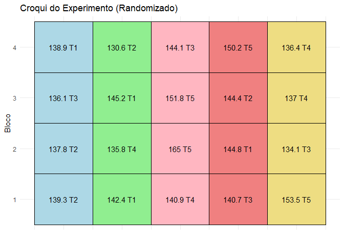
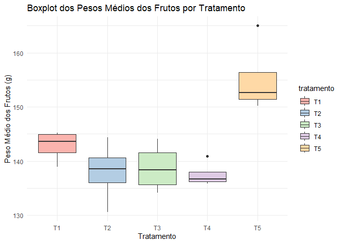
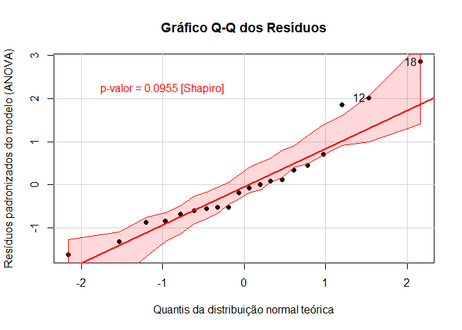
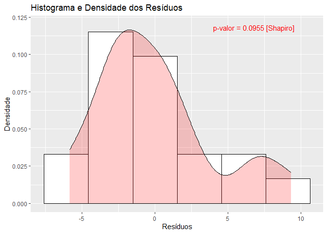
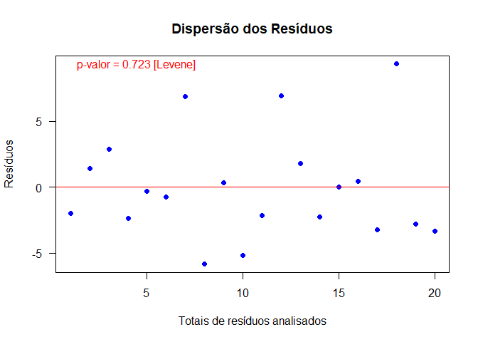
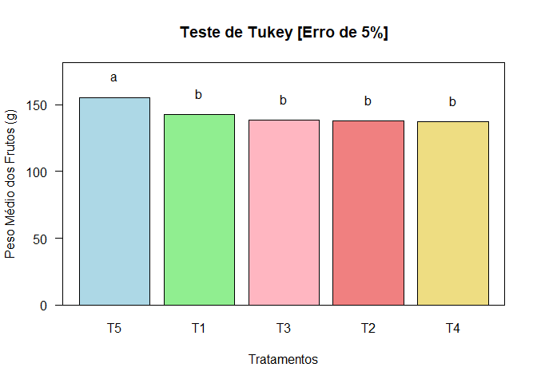

Análise Estatística dos Pesos Médios dos Frutos
================
Ramon Lima de Oliveira Tavares

# Introdução

Este documento apresenta uma análise estatística dos pesos médios dos
frutos, incluindo a criação de um croqui do experimento, boxplot, modelo
ANOVA e testes estatísticos.

# Dados de peso médio dos frutos, blocos e tratamentos

``` r
# Dados de peso médio dos frutos, blocos e tratamentos
pesoMedioFrutos <- c(
  142.4, 144.8, 145.2, 138.9,
  139.3, 137.8, 144.4, 130.6,
  140.7, 134.1, 136.1, 144.1,
  140.9, 135.8, 137, 136.4,
  153.5, 165, 151.8, 150.2
)

bloco <- rep(1:4, times = 5)
tratamento <- rep(c('T1', 'T2', 'T3', 'T4', 'T5'), each = 4)

# Criar dataframe
dados <- data.frame(
  peso = pesoMedioFrutos,
  bloco = bloco,
  tratamento = as.factor(tratamento)
)

print(dados)
```

    ##     peso bloco tratamento
    ## 1  142.4     1         T1
    ## 2  144.8     2         T1
    ## 3  145.2     3         T1
    ## 4  138.9     4         T1
    ## 5  139.3     1         T2
    ## 6  137.8     2         T2
    ## 7  144.4     3         T2
    ## 8  130.6     4         T2
    ## 9  140.7     1         T3
    ## 10 134.1     2         T3
    ## 11 136.1     3         T3
    ## 12 144.1     4         T3
    ## 13 140.9     1         T4
    ## 14 135.8     2         T4
    ## 15 137.0     3         T4
    ## 16 136.4     4         T4
    ## 17 153.5     1         T5
    ## 18 165.0     2         T5
    ## 19 151.8     3         T5
    ## 20 150.2     4         T5

# Estatísticas descritivas

``` r
# Estatísticas descritivas
descritiva <- data.frame(
  Media = mean(pesoMedioFrutos),
  Variancia = var(pesoMedioFrutos),
  Desvio_Padrao = sd(pesoMedioFrutos),
  Coeficiente_Variacao = sd(pesoMedioFrutos) / mean(pesoMedioFrutos)
)

print(descritiva)
```

    ##    Media Variancia Desvio_Padrao Coeficiente_Variacao
    ## 1 142.45  63.59526      7.974664            0.0559822

# Criar croqui usando ggplot2 com os tratamentos randomizados e os labels concatenados

``` r
cores_tratamentos <- c("T1" = "lightblue", "T2" = "lightgreen", "T3" = "lightpink", "T4" = "lightcoral", "T5" = "lightgoldenrod")

# Criar croqui usando ggplot2 com os tratamentos randomizados e os labels concatenados
croqui <- ggplot(dadosCroqui, aes(x = ficticio_x, y = factor(bloco), fill = tratamento)) +
  geom_tile(color = "black") +  # Adiciona bordas pretas aos quadrados
  geom_text(aes(label = label), color = "black", size = 4) +  # Adiciona texto com borda preta
  scale_fill_manual(values = cores_tratamentos) +  # Define as cores manualmente
  labs(title = "Croqui do Experimento (Randomizado)", x = "", y = "Bloco") +
  theme_minimal() +
  theme(axis.text.x = element_blank(),  # Remover rótulos do eixo X
        axis.ticks.x = element_blank())  +  # Remover marcas do eixo X
  guides(fill = FALSE)  # Remover a legenda do fill
print(croqui)
```

<!-- -->

# Criar um boxplot usando ggplot2

``` r
boxplot <- ggplot(dados, aes(x = tratamento, y = peso, fill = tratamento)) +
  geom_boxplot() +
  labs(title = "Boxplot dos Pesos Médios dos Frutos por Tratamento", x = "Tratamento", y = "Peso Médio dos Frutos (g)") +
  scale_fill_brewer(palette = "Pastel1") +
  theme_minimal()


# Salvar o boxplot como um arquivo de imagem
ggsave("boxplot.png", boxplot, width = 8, height = 6) 
print(boxplot)
```

<!-- -->

# Criar o modelo ANOVA

``` r
modelo <- aov(peso ~ tratamento + bloco, data = dados)
summary(modelo)
```

    ##             Df Sum Sq Mean Sq F value   Pr(>F)    
    ## tratamento   4  873.3  218.32   9.951 0.000499 ***
    ## bloco        1   27.9   27.88   1.271 0.278578    
    ## Residuals   14  307.1   21.94                     
    ## ---
    ## Signif. codes:  0 '***' 0.001 '**' 0.01 '*' 0.05 '.' 0.1 ' ' 1

# Teste de Shapiro-Wilk

``` r
testeShapiro <- shapiro.test(modelo$residuals)
pValor <- round(testeShapiro$p.value, 2)

if (pValor > 0.05) {
  cat("
  Como o p-valor [", pValor, "] é maior que o nível de significância [0.05],
  não temos evidências suficientes para rejeitar a hipótese nula, logo,
  podemos afirmar que os erros seguem estatisticamente uma distribuição normal.
  ")
} else {
  cat("
  Como o p-valor [", pValor, "] é menor que o nível de significância [0.05],
  rejeitamos a hipótese nula de que os erros seguem distribuição normal.
  ")
}
```

    ## 
    ##   Como o p-valor [ 0.1 ] é maior que o nível de significância [0.05],
    ##   não temos evidências suficientes para rejeitar a hipótese nula, logo,
    ##   podemos afirmar que os erros seguem estatisticamente uma distribuição normal.
    ## 

# Gráfico Q-Q dos Resíduos

``` r
qqPlot(modelo, main = "Gráfico Q-Q dos Resíduos", xlab = "Quantis da distribuição normal teórica", ylab = "Resíduos padronizados do modelo (ANOVA)", id.n = 4, simulate = TRUE, envelope = 0.95, col.lines = "red", pch = 19, rlm.control = list(maxit = 100))
```

    ## [1] 12 18

``` r
text(x = -1, y = 2.5, labels = paste("p-valor =", round(testeShapiro$p.value, 4), "[Shapiro]"), col = "red", pos = 1, cex = 1)
```

<!-- -->

# Histograma e Densidade dos Resíduos

``` r
histograma <- ggplot() +
  aes(x = modelo$residuals) +
  geom_histogram(aes(y = after_stat(density)), bins = 6, color = "black", fill = "white") +
  geom_density(aes(y = after_stat(density)), alpha = 0.20, fill = "red") +
  labs(x = "Resíduos", y = "Densidade", title = "Histograma e Densidade dos Resíduos") +
  annotate("text", x = 4, y = 0.12, label = paste("p-valor =", round(testeShapiro$p.value, 4), "[Shapiro]"), hjust = 0, vjust = 1, color = "red")

# Salvar o QQ como um arquivo de imagem
ggsave("histograma.png", histograma, width = 8, height = 6) 
print(histograma)
```

<!-- -->

# Teste de Levene

``` r
leveneTeste <- leveneTest(peso ~ tratamento, data = dados)
print(leveneTeste)
```

    ## Levene's Test for Homogeneity of Variance (center = median)
    ##       Df F value Pr(>F)
    ## group  4  0.5199 0.7225
    ##       15

``` r
pValorVar <- leveneTeste$`Pr(>F)`[1]
if (pValorVar > 0.05) {
  cat("
  Como o p-valor [", round(pValorVar, 3), "] > [0.05], não 
  há evidências estatísticas para rejeitar a hipótese nula, logo podemos
  afirmar que as variâncias são estatisticamente homogêneas.
  ")
} else {
  cat("
  Como o p-valor [", round(pValorVar, 3), "] < [0.05], rejeitamos 
  a hipótese nula de que as variâncias são homogêneas.
  ")
}
```

    ## 
    ##   Como o p-valor [ 0.723 ] > [0.05], não 
    ##   há evidências estatísticas para rejeitar a hipótese nula, logo podemos
    ##   afirmar que as variâncias são estatisticamente homogêneas.
    ## 

# Plotar a dispersão dos resíduos

``` r
plot(modelo$residuals, las = 1, pch = 19, col = "blue", main = "Dispersão dos Resíduos", ylab = "Resíduos", xlab = "Totais de resíduos analisados")
abline(h = 0, col = "red")
text(x = 1, y = max(modelo$residuals), labels = paste("p-valor =", round(pValorVar, 3), "[Levene]"), pos = 4, col = "red", cex = 1)
```

<!-- -->

# Realizar o teste de Tukey

``` r
testeTukey <- HSD.test(modelo, "tratamento", group = TRUE, console = TRUE)
```

    ## 
    ## Study: modelo ~ "tratamento"
    ## 
    ## HSD Test for peso 
    ## 
    ## Mean Square Error:  21.93869 
    ## 
    ## tratamento,  means
    ## 
    ##       peso      std r       se   Min   Max     Q25    Q50     Q75
    ## T1 142.825 2.894103 4 2.341938 138.9 145.2 141.525 143.60 144.900
    ## T2 138.025 5.699342 4 2.341938 130.6 144.4 136.000 138.55 140.575
    ## T3 138.750 4.511836 4 2.341938 134.1 144.1 135.600 138.40 141.550
    ## T4 137.525 2.302716 4 2.341938 135.8 140.9 136.250 136.70 137.975
    ## T5 155.125 6.719809 4 2.341938 150.2 165.0 151.400 152.65 156.375
    ## 
    ## Alpha: 0.05 ; DF Error: 14 
    ## Critical Value of Studentized Range: 4.40661 
    ## 
    ## Minimun Significant Difference: 10.32 
    ## 
    ## Treatments with the same letter are not significantly different.
    ## 
    ##       peso groups
    ## T5 155.125      a
    ## T1 142.825      b
    ## T3 138.750      b
    ## T2 138.025      b
    ## T4 137.525      b

``` r
print(testeTukey)
```

    ## $statistics
    ##    MSerror Df   Mean       CV   MSD
    ##   21.93869 14 142.45 3.288084 10.32
    ## 
    ## $parameters
    ##    test     name.t ntr StudentizedRange alpha
    ##   Tukey tratamento   5          4.40661  0.05
    ## 
    ## $means
    ##       peso      std r       se   Min   Max     Q25    Q50     Q75
    ## T1 142.825 2.894103 4 2.341938 138.9 145.2 141.525 143.60 144.900
    ## T2 138.025 5.699342 4 2.341938 130.6 144.4 136.000 138.55 140.575
    ## T3 138.750 4.511836 4 2.341938 134.1 144.1 135.600 138.40 141.550
    ## T4 137.525 2.302716 4 2.341938 135.8 140.9 136.250 136.70 137.975
    ## T5 155.125 6.719809 4 2.341938 150.2 165.0 151.400 152.65 156.375
    ## 
    ## $comparison
    ## NULL
    ## 
    ## $groups
    ##       peso groups
    ## T5 155.125      a
    ## T1 142.825      b
    ## T3 138.750      b
    ## T2 138.025      b
    ## T4 137.525      b
    ## 
    ## attr(,"class")
    ## [1] "group"

``` r
# Criar um barplot com os grupos do teste de Tukey
colors <- c("lightblue", "lightgreen", "lightpink", "lightcoral", "lightgoldenrod")

# Adicionar cor ao gráfico
bar.group(testeTukey$groups, las = 1, ylim = c(0, max(dados$peso) * 1.10), xlab = "Tratamentos", ylab = "Peso Médio dos Frutos (g)", main = "Teste de Tukey [Erro de 5%]", col = colors)
box()
```

<!-- -->
